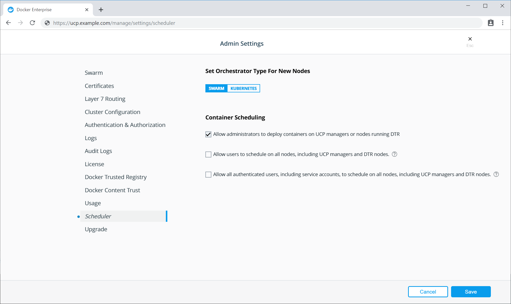
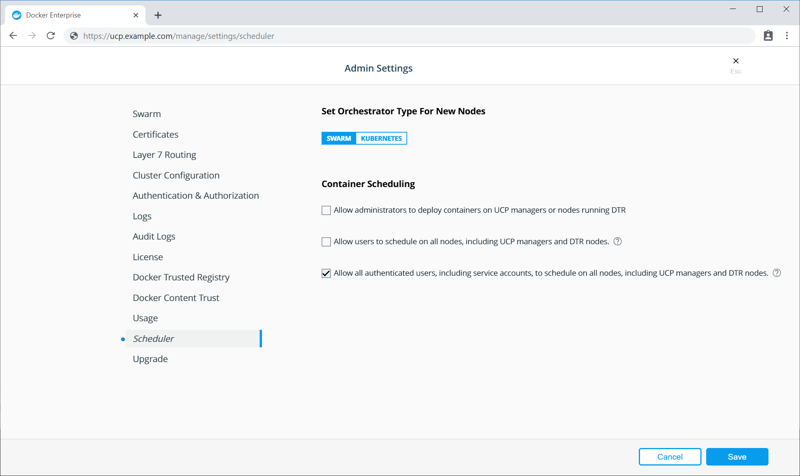

>

You can configure UCP to allow users to deploy and run services only in
worker nodes. This ensures all cluster management functionality stays
performant, and makes the cluster more secure.

If a user deploys a malicious service that can affect the node where it
is running, it won't be able to affect other nodes in the cluster, or
any cluster management functionality.

## Swarm Workloads

To restrict users from deploying to manager nodes, log in with administrator
credentials to the UCP web interface, navigate to the **Admin Settings**
page, and choose **Scheduler**.

{: .with-border}

You can then choose if user services should be allowed to run on manager nodes
or not.

Having a grant with the `Scheduler` role against the `/` collection takes
precedence over any other grants with `Node Schedule` on subcollections.

## Kubernetes Workloads

By default Universal Control Plane clusters takes advantage of [Taints and
Tolerations](https://kubernetes.io/docs/concepts/configuration/taint-and-toleration/)
to prevent a User's workload being deployed on to UCP Manager or DTR Nodes. 

You can view this taint by running:

```bash
$ kubectl get nodes <ucpmanager> -o json | jq -r '.spec.taints | .[]'
{
  "effect": "NoSchedule",
  "key": "com.docker.ucp.manager"
}
```

> Note: Workloads deployed by an Administrator in the `kube-system` namespace do
> not follow these scheduling constraints. If an Administrator deploys a
> workload in the `kube-system` namespace, a toleration is applied to bypass
> this taint, and the workload is scheduled on all node types.

### Allow Administrators to Schedule on Manager / DTR Nodes

To allow Administrators to deploy workloads accross all nodes types, an
Administrator can tick the "Allow administrators to deploy containers on UCP
managers or nodes running DTR" box in the UCP web interface. 

{: .with-border}

For all new workloads deployed by Administrators after this box has been
ticked, UCP will apply a toleration to your workloads to allow the pods to be
scheduled on all node types.

For existing workloads, the Administrator will need to edit the Pod
specification, through `kubectl edit <object> <workload>` or the UCP web interface and add
the following toleration:

```bash
tolerations:
- key: "com.docker.ucp.manager"
  operator: "Exists"
```

You can check this has been applied succesfully by:

```bash
$ kubectl get <object> <workload> -o json | jq -r '.spec.template.spec.tolerations | .[]'
{
  "key": "com.docker.ucp.manager",
  "operator": "Exists"
}
```

### Allow Users and Service Accounts to Schedule on Manager / DTR Nodes

To allow Kubernetes Users and Service Accounts to deploy workloads accross all
node types in your cluster, an Administrator will need to tick "Allow all
authenticated users, including service accounts, to schedule on all nodes,
including UCP managers and DTR nodes." in the UCP web interface. 

{: .with-border}

For all new workloads deployed by Kubernetes Users after this box has been
ticked, UCP will apply a toleration to your workloads to allow the pods to be
scheduled on all node types. For existing workloads, the User would need to edit
Pod Specification as detailed above in the "Allow Administrators to Schedule on
Manager / DTR Nodes" section.

There is a NoSchedule taint on UCP managers and DTR nodes and if you have
scheduling on managers/workers disabled in the UCP scheduling options, then a
toleration for that taint will not get applied to the deployments, so they
should not schedule on those nodes. Unless the Kube workload is deployed in the
`kube-system` name space.

## Where to go next

- [Deploy an Application Package](/ee/ucp/deploy-application-package/)
- [Deploy a Swarm Workload](/ee/ucp/swarm/)
- [Deploy a Kubernetes Workload](/ee/ucp/kubernetes//)
